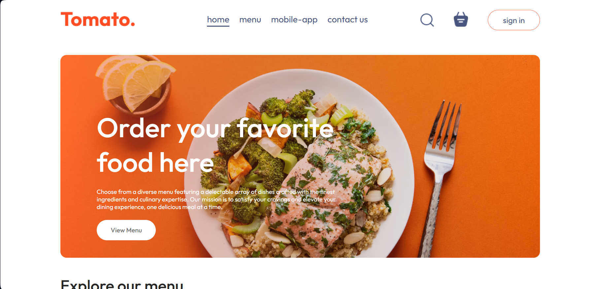
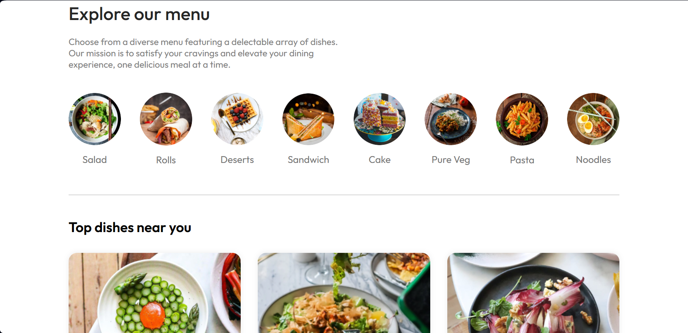
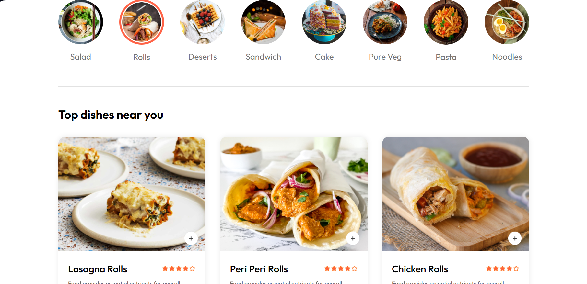
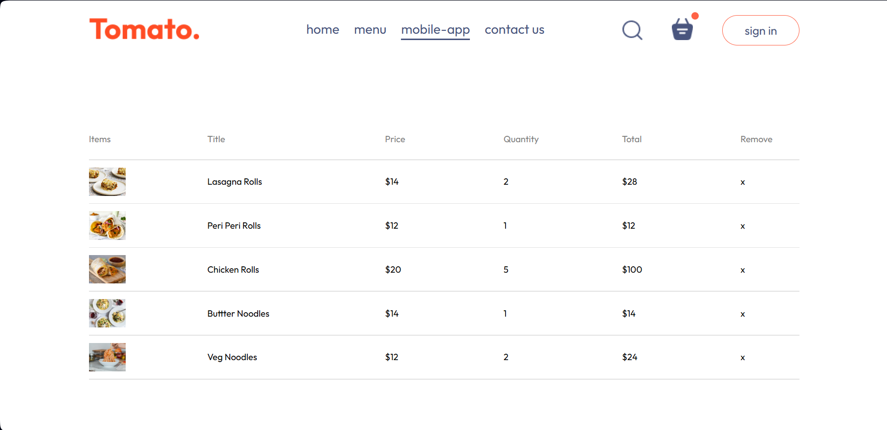
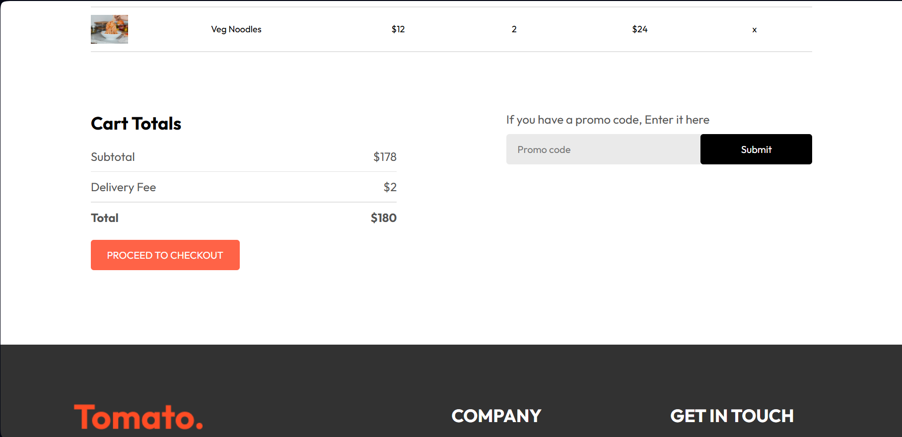
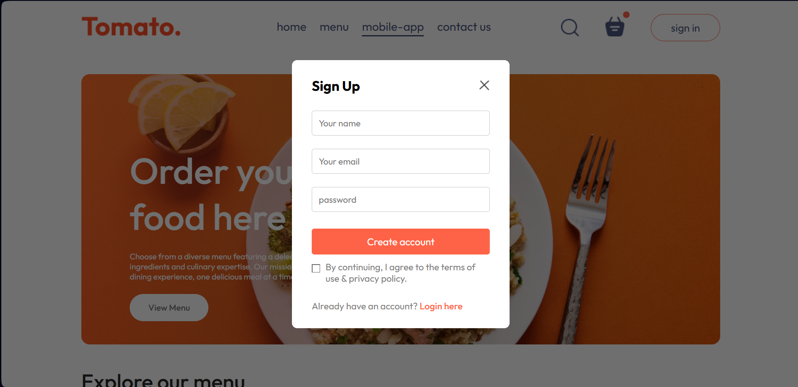
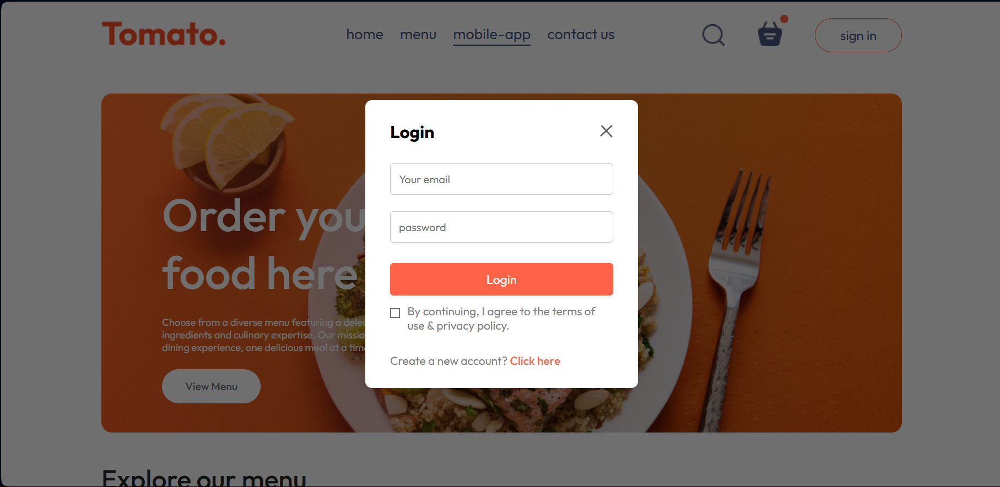

# 🍅 Tomato – Food Delivery Website

A modern, responsive **Food Delivery Frontend Website** built with **React.js**.  
Tomato allows users to explore delicious dishes, browse categories, and interact with a clean UI designed for an amazing food ordering experience.

🔗 **Live Demo**: [Tomato Food App](https://tomato-app-food.vercel.app)
📂 **GitHub Repository**: [View Code](https://github.com/ShahmirAliQureshii/Food-Delivery-app-React)

## ✨ Features

- 🏠 **Home Page** – Hero section with a call to action for ordering food.
- 🍽️ **Menu Page** – Explore different categories like Salads, Rolls, Sandwiches, Desserts, Cakes, Pasta, and more.
- 📱 **Mobile-App Page** – Highlights the availability of the app.
- 📞 **Contact Page** – Get in touch for queries.
- 🛒 **Cart System (UI only)** – Add and manage items in your cart.
- 🔑 **Authentication UI** – Sign in & Sign up modal form.
- ❌ **Error Handling Page** – Custom error page when a route doesn’t exist.

## 📸 Screenshots

### Home Page



### Explore Menu Page



### Menu Page



### Mobile App


### Cart Page



### Cart Total



### Sign Up Modal



### Sign Up Modal



## 🛠️ Tech Stack

- **Frontend**: React.js
- **Styling**: CSS
- **Deployment**: Vercel

## 🚀 Getting Started

Follow these steps to run the project locally:

# Clone the repository

```bash
git clone https://github.com/ShahmirAliQureshii/Food-Delivery-app-React.git
```

# Navigate into the project folder

```bash
cd Food-Delivery-app-React
```

# Install dependencies

```bash
npm install
```

# Run the development server

```bash
npm run dev
```

Project will start at http://localhost:5173 (Vite default).

📌 Future Improvements
🗄️ Connect with backend & database for real-time data.

🛍️ Enable order placement & payment gateway.

📱 Make it a complete full-stack food delivery application.

👨‍💻 Author
Made with ❤️ by Shahmir Ali Qureshi
